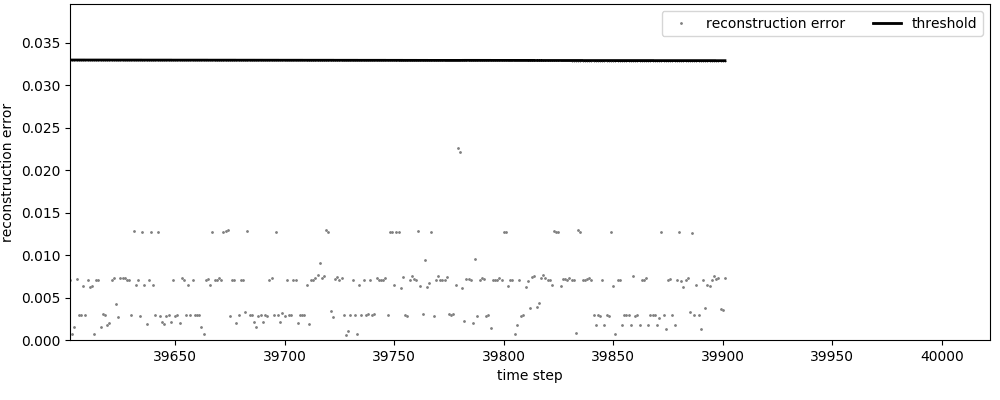
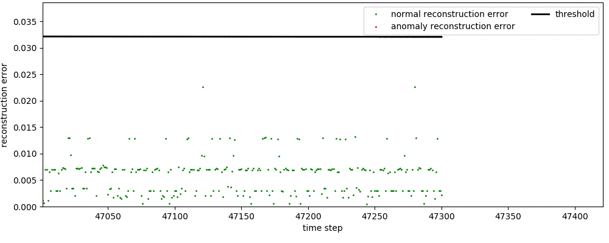
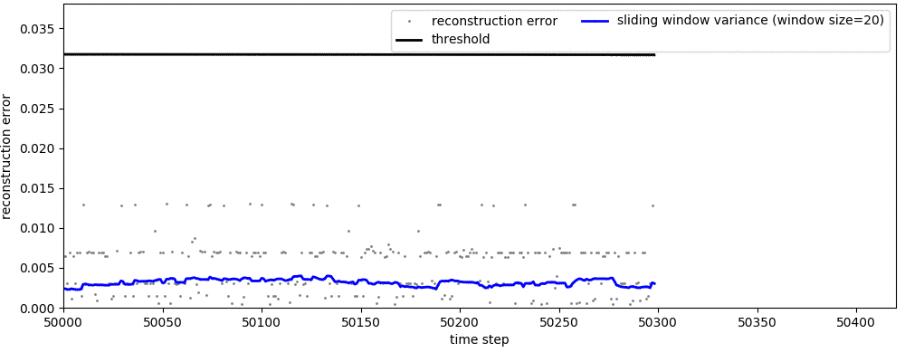

# Visualizing dynamic thresholding on neural network reconstruction errors with matplotlib animations

## Information

This simple python class visualizes an anomaly detection model for data streams with [matplotlib animations](https://matplotlib.org/3.1.1/api/animation_api.html). 

The machine learning model (called _rIFTM_, a more robust version of [this](https://www.researchgate.net/publication/327484223_IFTM_-_Unsupervised_Anomaly_Detection_for_Virtualized_Network_Function_Services) approach) learns to predict the normal operation mode of a monitored cloud service from solely normal data by using an LSTM neural network and applies dynamic thresholding (we apply a combination of cumulative aggregation functions) on the history of previous reconstruction errors. 

The reconstruction error is given by the difference (we computed the [euclidean distance](https://en.wikipedia.org/wiki/Euclidean_distance)) between the neural network's prediction for time step t and the actual preserved value at the given time step.

## Examples

Plotting reconstruction errors and dynamic thresholding without classes (hide_classes=True)




Plotting classes denoted with colors (hide_classes=False)




Plotting sliding window standard deviation and dynamic thresholding on the reconstruction errors. The sliding window standard deviation is an alternative approach to monitor the pattern of reconstruction errors in a sliding window instead of modeling the upper boundary of the normal reconstruction errors. (hide_classes=False, show_srd=True, std_window_size=20)




## Settings

Set the configuration object to customize the animation. The following parameters can be set

```python
"""
Parameters
----------
reconstruction_errors: list or numpy.ndarray
    history of reconstruction errors
threshold: list or numpy.ndarray
    history of threshold values
class_labels: list or numpy.ndarray
    class labels denoting anomalies (1) and normal data (0)
animation_window_size:
    how many points to show at once (default: 300)
update_interval:
    defines the speed of the animation (default 25ms)
start: int
    from which index to start the visualization (default: 0)
hide_classes: boolean
    color reconstruction errors according to their classes (default: True)
adjust_y_to_threshold: boolean 
    adjust the maximum value of the y axis  (default False)
show_std: boolean
    showing the computed sliding-window standard deviation of the reconstruction errors (default: True)
std_window_size: int
    the size of the sliding window (default: 50)
"""
```

which you can provide as a dictionary to your Time_series_animation class.

```python
configuration = {
    'reconstruction_errors': np.load('example_data/reconstruction_errors.npy'),
    'threshold': np.load('example_data/threshold_history.npy'),
    'class_labels': np.load('example_data/target_labels.npy'),
    'animation_window_size': 300,
    'update_interval': 20,
    'start': 0,
    'hide_classes': False,
    'adjust_y_to_threshold': True,
    'show_std': True,
    'std_window_size': 20
}
```

## Usage
Initialize a Time_series_animation object with the chosen configuration settings.

```python
#initialize object
animator = Time_series_animation(**configuration)
animator.play()
```

Save the animation to a file. Make sure to install [ImageMagick](https://imagemagick.org/index.php) to export GIF files. 

```python
#save animation
animator.save_to_file('export.gif')
```

## Licence

Apache 2.0